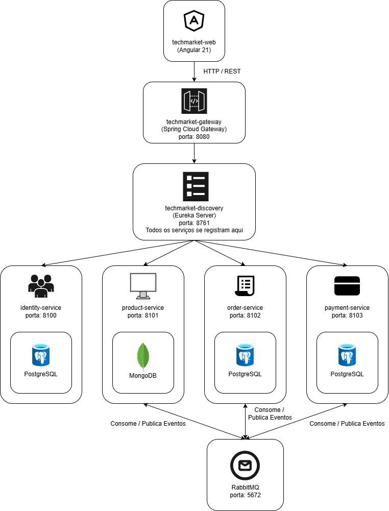

<div align="center">

# 🛒 TechMarket

### Plataforma de e-commerce moderna e escalável baseada em microsserviços

<br/>

[](https://www.oracle.com/java/)
[](https://spring.io/projects/spring-boot)
[](https://angular.io/)
[](https://www.rabbitmq.com/)
[](https://www.postgresql.org/)
[](https://www.mongodb.com/)
[](https://www.docker.com/)

</div>

---

## 📋 Índice

- [Sobre o TechMarket](#-sobre-o-techmarket)
- [Arquitetura da Solução](#-arquitetura-da-solução)
- [Principais Funcionalidades](#-principais-funcionalidades)
- [Tecnologias Utilizadas](#-tecnologias-utilizadas)
- [Pré-requisitos](#-pré-requisitos)
- [Como Rodar o Projeto](#-como-rodar-o-projeto)
- [Variáveis de Ambiente](#-variáveis-de-ambiente)
- [Endpoints dos Serviços](#-endpoints-dos-serviços)
- [Repositórios](#-repositórios)
- [Demonstração](#-demonstração)
- [Autor](#-autor)

---

## 💡 Sobre o TechMarket

O **TechMarket** é uma plataforma completa de e-commerce voltada para a venda de produtos de tecnologia. O projeto foi construído do zero com foco em **escalabilidade**, **desacoplamento entre domínios** e **boas práticas de engenharia de software**.

A aplicação utiliza uma arquitetura de **microsserviços**, onde cada serviço é responsável por um domínio de negócio específico, se comunica de forma assíncrona via **RabbitMQ** e possui seu próprio banco lógico (database), garantindo isolamento de dados por domínio. Isso garante total autonomia entre os domínios e facilita a evolução independente de cada parte do sistema.

O backend é composto por serviços desenvolvidos em **Java 21 com Spring Boot**, aproveitando os recursos modernos da linguagem. O frontend foi construído com **Angular**, entregando uma experiência de usuário fluida e responsiva. Toda a infraestrutura pode ser iniciada com um único comando via **Docker Compose**.

---

## 🏗️ Arquitetura da Solução

O TechMarket é organizado como um monorepo com submódulos Git, onde cada microsserviço vive em seu próprio repositório e é referenciado no repositório principal.



### Padrões e decisões de arquitetura

| Decisão | Detalhe |
|---------|---------|
| **Comunicação síncrona** | REST/HTTP entre Frontend → Gateway → Serviços |
| **Comunicação assíncrona** | RabbitMQ para eventos entre microsserviços (ex: pedido criado → processamento de pagamento) |
| **Service Discovery** | Eureka Server — os serviços se registram e se localizam dinamicamente |
| **API Gateway** | Spring Cloud Gateway centraliza o roteamento e a autenticação |
| **Autenticação** | JWT gerado pelo Identity Service e validado no Gateway |
| **Database per Service** | Cada serviço possui seu próprio banco, garantindo independência de domínio |

### Bancos de dados

| Banco | Tipo | Utilizado por |
|-------|------|---------------|
| **PostgreSQL** | Relacional | Identity, Order e Payment Services |
| **MongoDB** | NoSQL (documentos) | Product Service |

### Integração Contínua (CI/CD)

Todos os repositórios do ecossistema TechMarket possuem pipelines de integração contínua configurados com GitHub Actions.

A cada push ou pull request, são executadas etapas automatizadas como:

- Build dos serviços (Maven / Angular)
- Execução de testes automatizados
- Verificação de integridade do código

A branch `main` é protegida em todos os repositórios, garantindo que:

- Alterações só possam ser feitas via Pull Request
- O merge só ocorre após aprovação
- Os pipelines de CI devem passar com sucesso antes do merge

Essas práticas garantem maior confiabilidade, qualidade de código e segurança no processo de desenvolvimento.

---

## ⚙️ Principais Funcionalidades

### 🔐 Identidade e Autenticação (`identity-service`)
- Cadastro e login de usuários
- Geração e validação de tokens JWT
- Controle de acesso por perfis (roles)

### 📦 Produtos (`product-service`)
- Cadastro, edição e remoção de produtos
- Listagem com filtros por categoria e nome
- Consulta de detalhes e disponibilidade em estoque
- Publicação de eventos via RabbitMQ ao atualizar estoque

### 🛒 Pedidos (`order-service`)
- Criação e acompanhamento de pedidos
- Verificação de disponibilidade de produtos
- Publicação de eventos de pedido para o serviço de pagamento

### 💳 Pagamentos (`payment-service`)
- Processamento assíncrono de pagamentos via eventos RabbitMQ
- Atualização do status do pedido após confirmação

### 🌐 Gateway (`gateway-service`)
- Roteamento centralizado de requisições para os serviços
- Ponto único de entrada para o frontend

### 🔍 Discovery (`discovery-service`)
- Registro e descoberta dinâmica de serviços via Eureka Server

### 🖥️ Frontend (`techmarket-web`)
- Interface de usuário construída em Angular
- Navegação por produtos, carrinho e fluxo de compra
- Integração com todos os serviços via Gateway

---

## 🛠️ Tecnologias Utilizadas

| Camada | Tecnologia |
|--------|-----------|
| **Frontend** | Angular 21, TypeScript, HTML5, Tailwind |
| **Backend** | Java 21, Spring Boot, Spring Web, Spring Cloud Gateway, Spring Security, Spring Data JPA, PostgreSQL Driver, Spring Data MongoDB, Spring AMQP, Spring Validation |
| **Mensageria** | RabbitMQ 4 |
| **Banco Relacional** | PostgreSQL 16 |
| **Banco NoSQL** | MongoDB 7 |
| **Service Discovery** | Netflix Eureka (Spring Cloud Netflix) |
| **Autenticação** | JWT (JSON Web Tokens) |
| **Containerização** | Docker, Docker Compose |
| **Build** | Maven (Maven Wrapper) |

---

## ✅ Pré-requisitos

Antes de iniciar, certifique-se de ter instalado em sua máquina:

- [Git](https://git-scm.com/) — para clonar o repositório com os submódulos
- [Docker](https://www.docker.com/) (versão 24+)
- [Docker Compose](https://docs.docker.com/compose/) (versão 2+)

> **Não é necessário** ter Java, Node.js ou Maven instalados localmente. Tudo roda via Docker.

---

## 🚀 Como Rodar o Projeto

### 1. Clone o repositório com os submódulos

Este repositório utiliza **Git Submodules**. É fundamental usar a flag `--recurse-submodules` para clonar todos os serviços de uma vez:

```bash
git clone --recurse-submodules https://github.com/felipesora/techmarket.git
```

Caso já tenha clonado sem a flag, execute:

```bash
git submodule update --init --recursive
```

### 2. Acesse o diretório do projeto

```bash
cd techmarket
```

### 3. Suba toda a infraestrutura com Docker Compose

```bash
docker compose up -d --build
```

> O processo de build pode levar alguns minutos na primeira execução, pois todos os serviços serão compilados e as imagens Docker construídas.

### 4. Aguarde todos os serviços ficarem saudáveis

O Docker Compose respeita a ordem de inicialização com `depends_on` e `healthcheck`. A ordem esperada é:

```
postgres + mongodb + rabbitmq  →  discovery-service  →  identity-service
→  product-service  →  order-service  →  payment-service  →  gateway-service → frontend
```

Você pode acompanhar os logs em tempo real:

```bash
docker compose logs -f
```

Ou verificar o status dos containers:

```bash
docker compose ps
```

### 5. Acesse a aplicação

| Serviço | URL |
|---------|-----|
| **Frontend (Angular)** | `http://localhost:4200` |
| **API Gateway** | `http://localhost:8080` |
| **Eureka Dashboard** | `http://localhost:8761` |
| **RabbitMQ Management** | `http://localhost:15672` (usuário: `admin` / senha: `admin`) |

### 6. Para encerrar

```bash
docker compose down
```

Para remover também os volumes (dados dos bancos):

```bash
docker compose down -v
```

---

## 🔧 Variáveis de Ambiente

As variáveis abaixo são configuradas automaticamente pelo `docker-compose.yml`. Caso queira rodar os serviços localmente fora do Docker, configure-as no `application.properties` ou como variáveis de ambiente do sistema.

| Variável | Descrição | Valor padrão (Docker) |
|----------|-----------|----------------------|
| `POSTGRES_HOST` | Host do PostgreSQL | `postgres` |
| `POSTGRES_PORT` | Porta do PostgreSQL | `5432` |
| `POSTGRES_USER` | Usuário do banco | `postgres` |
| `POSTGRES_PASSWORD` | Senha do banco | `root` |
| `MONGODB_HOST` | Host do MongoDB | `mongodb` |
| `MONGODB_PORT` | Porta do MongoDB | `27017` |
| `RABBITMQ_HOST` | Host do RabbitMQ | `rabbitmq` |
| `RABBITMQ_PORT` | Porta do RabbitMQ | `5672` |
| `RABBITMQ_USERNAME` | Usuário do RabbitMQ | `admin` |
| `RABBITMQ_PASSWORD` | Senha do RabbitMQ | `admin` |
| `JWT_SECRET` | Chave secreta para JWT | `minha-senha-super-secreta` |

> ⚠️ **Atenção:** Em produção, substitua `JWT_SECRET` por uma chave segura e mantenha as credenciais fora do controle de versão utilizando um arquivo `.env` ou um cofre de segredos.

---

## 🌐 Endpoints dos Serviços

Todas as requisições do frontend passam pelo **Gateway** (`http://localhost:8080`). As portas individuais são expostas apenas para desenvolvimento e debug.

| Serviço | Porta interna | Porta exposta |
|---------|--------------|---------------|
| `discovery-service` | 8761 | 8761 |
| `gateway-service` | 8080 | 8080 |
| `identity-service` | 8100 | 8100 |
| `product-service` | 8101 | 8101 |
| `order-service` | 8102 | 8102 |
| `payment-service` | 8103 | 8103 |
| `PostgreSQL` | 5432 | 5433 |
| `MongoDB` | 27017 | 27018 |
| `RabbitMQ AMQP` | 5672 | 5672 |
| `RabbitMQ Management` | 15672 | 15672 |

---

## 📁 Repositórios

O TechMarket é organizado como um **monorepo com submódulos Git**. Cada serviço possui seu próprio repositório:

| Serviço | Descrição | Repositório |
|---------|-----------|-------------|
| 🗂️ **techmarket** | Repositório principal (monorepo + Docker Compose) | [github.com/felipesora/techmarket](https://github.com/felipesora/techmarket) |
| 🔍 **discovery-service** | Eureka Server para service discovery | [github.com/felipesora/techmarket-discovery-service](https://github.com/felipesora/techmarket-discovery-service) |
| 🌐 **gateway-service** | API Gateway com Spring Cloud Gateway | [github.com/felipesora/techmarket-gateway-service](https://github.com/felipesora/techmarket-gateway-service) |
| 🔐 **identity-service** | Autenticação e gerenciamento de usuários (JWT) | [github.com/felipesora/techmarket-identity-service](https://github.com/felipesora/techmarket-identity-service) |
| 📦 **product-service** | Catálogo e gerenciamento de produtos | [github.com/felipesora/techmarket-product-service](https://github.com/felipesora/techmarket-product-service) |
| 🛒 **order-service** | Criação e acompanhamento de pedidos | [github.com/felipesora/techmarket-order-service](https://github.com/felipesora/techmarket-order-service) |
| 💳 **payment-service** | Processamento de pagamentos via mensageria | [github.com/felipesora/techmarket-payment-service](https://github.com/felipesora/techmarket-payment-service) |
| 🖥️ **techmarket-web** | Frontend da plataforma em Angular | [github.com/felipesora/techmarket-web](https://github.com/felipesora/techmarket-web) |

---

## 🎬 Demonstração

Veja o TechMarket em funcionamento:

> 🎥 **[Assista à demonstração completa aqui](https://youtu.be/RCs4tMAQMho)**

---

## 👨‍💻 Autor

Desenvolvido por **Felipe Sora**

[](https://www.linkedin.com/in/felipesora)
[](https://github.com/felipesora)